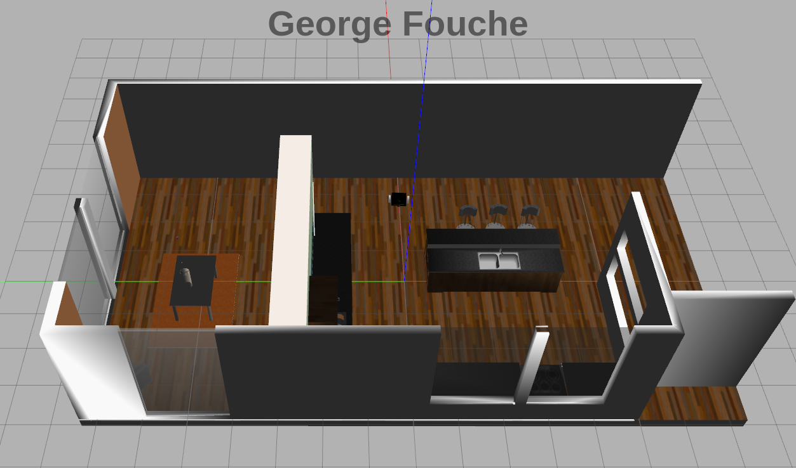
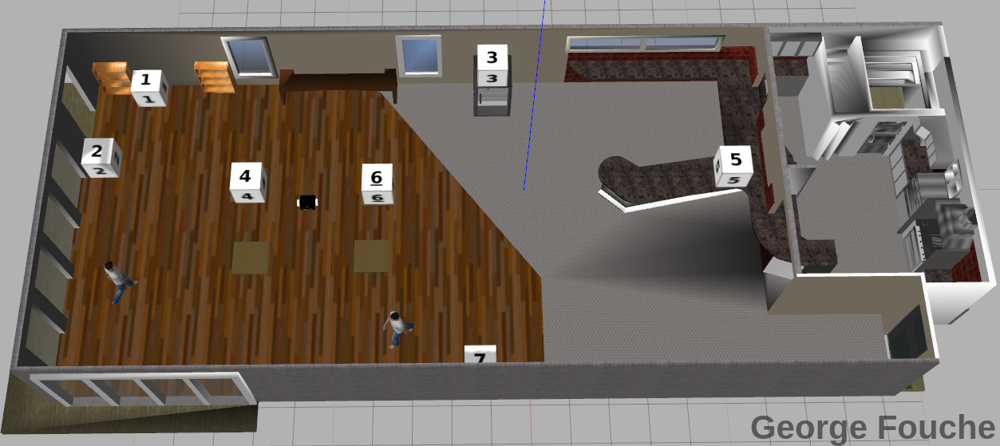
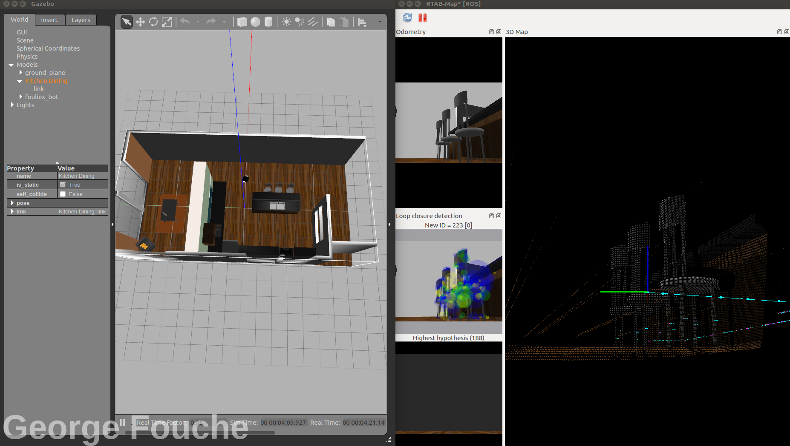
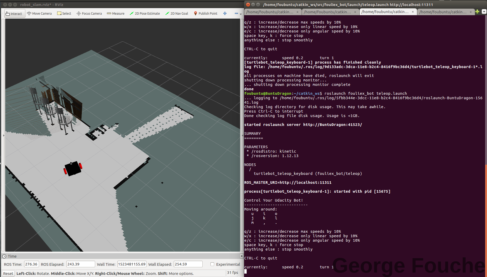
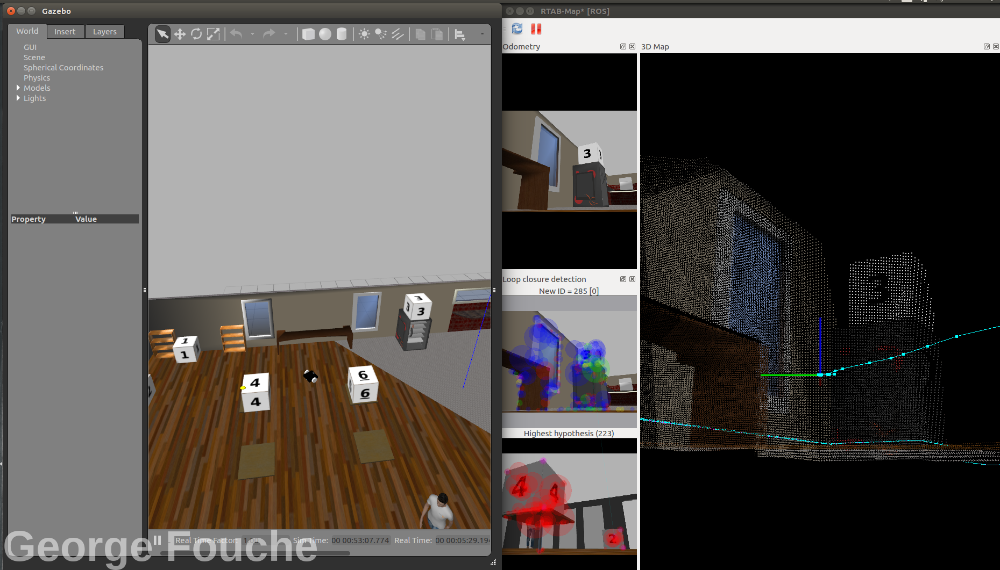
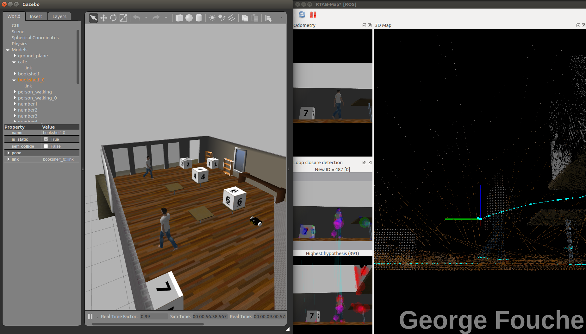
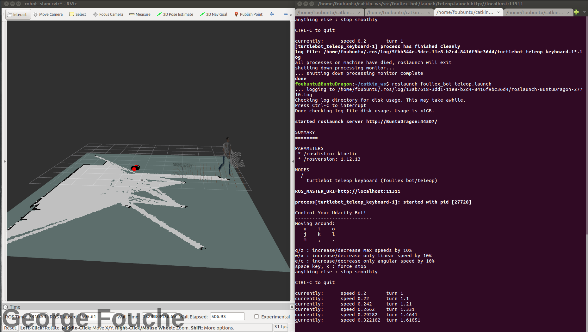
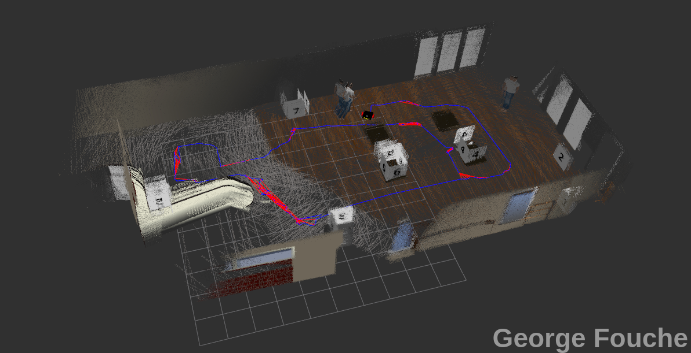
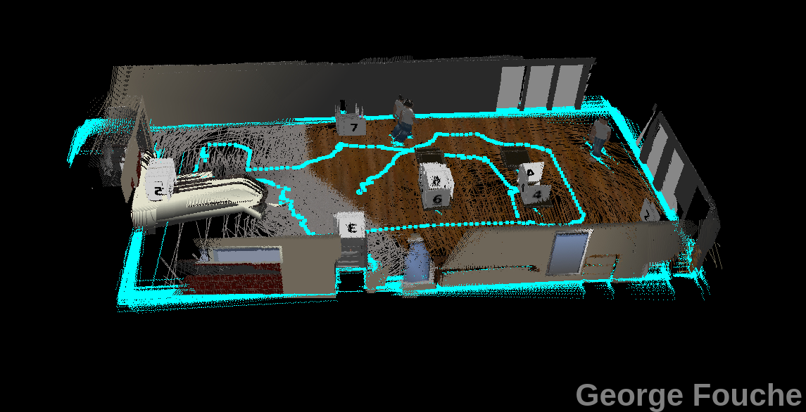

[//]: # (Image References)
[image_0]: ./misc/mainImage.gif
# Map a World with Slam and a custom Robot
![alt text][image_0] 

## Abstract
 This project is about implementing *SLAM*(Simultaneous Localization and mapping) with *RTAB-MAP*(Real-Time Appereance-Base Mapping). Two 2D occupancy grid and a 3D octomap is created from a simulated environment and then map with a custom robot [FouliexBot](https://github.com/fouliex/CustomRobotLocalizationProject).
 
 ## Introduction
In *Localization*, a robot is provided to map its environment. The robot has access to its movement and sensor data and uses them to estimate its pose. However,  there are many applications where there isn't a known map because the area is unexplored or because the surrounding change often; therefore the map is not up to date. In such case, the robot will have to construct a map, and this leads to robotic mapping.
 
Mapping assumes that the robot knows its pose and as usual has access to its movement and sensor data. The robot must produce a map of the environment using the known trajectory and measurement data. However, even such case can be quite uncommon in the real world. Most of the time the robot would have neither a map nor know its pose, and this is where *SLAM* comes in.
 
With *SLAM*, FouliexBot does an outstanding job with just its own movement and sensory data to build a map of its environment while simultaneously localizing itself relative to building map.

## Background
*SLAM* has 2 best approach which are *Grid-based FastSLAM* and *GraphSLAM*.

## Grid-based FastSLAM
The *FastSLAM* algorithm uses a custom particle filter approach to solve the [full SLAM problem](http://ais.informatik.uni-freiburg.de/teaching/ws12/mapping/pdf/slam01-intro-4.pdf) with known correspondences.
Using particles, *FastSLAM* estimates a posterior over the robot path along with the map. Each of these particles holds the robot trajectory which will give an advantage to *SLAM* to solve the problem of mapping with known poses. In addition, to the robot trajectory, each particle holds a map and a local Gaussian represents each feature of the map. With this algorithm, the problem divided into a separate independent problem. Each of which aims to solve the problem of estimating features of the map. To solve these independent mini problems, FastSlam uses the low dimensional extended Kalman filter. While math features are treated independently, dependency only exists between robot pose uncertainty. This custom approach of representing posterior with particle filter and Gaussian is known by the *Rao-Blackwellized Particle Filter One*. With the Monte Carlo Localization(MCL) *FastSLAM* estimates the robot trajectory and with Low-Dimensional Extended Kalman Filter (EKF), *FastSLAM* estimates features of the map.

## GraphSLAM

*GraphSlam* is another *SLAM* algorithm that solves the [full SLAM problem](http://ais.informatik.uni-freiburg.de/teaching/ws12/mapping/pdf/slam01-intro-4.pdf). This means that the algorithm recovers the entire path and map, instead of just the most recent pose and map. This difference allows it to consider dependencies between current and previous poses. 

### An Example of GraphSLAM
One example of our GraphSLAM would be applicable is an underground mining. Larges machine called bores,spent every day cutting away at the rockface. The environment changes rapidly and it's important to keep an accurate map of the workspace. One way to map this space would be to drive a vehicle with a LIDAR around the environment and collects data about the surroundings. Then, after the fact, the data can be analyzed to create an accurate map of the environment. 

### GraphSlAM vs FastSLAM
 *GraphSLAM* has a better accuracy over *FastSLAM*. *FastSLAM*  uses particles to intimate the robot's most likely pose. However, at any point in time, it's possible that there isn't a particle in the most likely location. In fact, the chances are slim to none especially, in large environments. Since *GraphSLAM* solves the [full SLAM problem](http://ais.informatik.uni-freiburg.de/teaching/ws12/mapping/pdf/slam01-intro-4.pdf), this means that it can work with all of the data at once to find the optimal solution. *FastSLam* uses a little bit of information with a finite number of particles; therefore there's room for errors.

## RTAB-MAP
Real-Time Appearance-Based Mapping(RTAB-Map) is an RGB-D Graph-Based SLAM approach based on an incremental appearance-based loop closure detector. For this project, RTAB-MAP is used, and it is composed of Front-end and Back-end.

## Front-End and Back-End
The goal of *GraphSLAM* is to create a graph of all robot poses and features encountered in the environment and find the most like robot's path and map of the environment. This task can be broken up into two sections, the *Front-end* and *Back-end*.

The *Front-end* of *GraphSLAM* looks at how to construct the graph using the odometry and sensory measurements collected by the robot. This includes interpreting sensory data, creating the graph, and continuing to add nodes and edges to it as the robot traverses the environment.

The *Front-end* can differ greatly from application to application depending on the desired goal, including accuracy, the sensor used, and other factors. For instance, the *Front-end* of a mobile robot applying SLAM in an office environment using a Laser Range Finder would differ from the *Front-end* for a vehicle operating on a large outdoor environment and using a Stereo Camera.

The *Front-end* of GraphSlam also solve the data association problem meaning it accurately identifying whether features in the environment have been previously seen.

The *Back-end* of GraphSLAM is where the magic happens. The input to the *Back-end* is the completed graph with all of the constraints. And the output is the most probable configuration of robot poses and map features. The back-end is an optimization process that takes all of the constraints and finds the system configuration that produces the smallest error. It is a lot more consistent across applications.

For this project, the *Front-end* and *Back-end* are performed iteratively, with a *Back-end* feeding an updated graph to the *Front-end* for further processing.

## Robot Model Configuration
For this project the robot model is the FouliexBot created in the [Custom Robot Localization Project](https://github.com/fouliex/CustomRobotLocalizationProject). Fouliexbot camera for this project has been updated with a [Kinect Sensor](http://wiki.ros.org/openni_camera) and a RGB-D Camera.The Kinect Sensor is monted in the front of FouliexBot and the RGB-D carera is mounted in the top-front of the robot.Below is the visualization of FouliexBot Frames


#### FouliexBot Configuration Frames

Below is FouliexBot configuration frame
The ROS tf library is use to keep track of all the different coordinate frames and defines their relation with one another. For this project the tf view_frames is use to create the graphical representation of FouliexBot.

## World 
Two worlds are created and use in this project. The first is a kitchen dining World and the other one is (Create other world).
#### Kitchen Dining World

#### Cafe World


## Result
### FouliexBot mapping the Kitchen Dining World


### FouliexBot mapping the Cafe World






## Discussions
FouliexBot was able to map the Kitchen Dining and Cafe world successfully. As the robot moves around the room, more data are captured and the 2D and 3D map keep increasing. One problem is that each pink line are where 
the robot slipped and each time that happened the mapping become  fuzzy which is why in the cafe world below the mapping is not clear. This can get fix by updating the wheels of FouliexBot to be less slippery on the Cafe and Kitchen Dining environment.


## Future Work
 Future work can be to to use RTAB-Map in a real home by leverage and update [BlueBot](https://github.com/fouliex/BlueBot) with a with a Kinect Sensor  a RGB-D Camera and replacing the Arduino Board with a Jetson Board.

## Project Setup
Download the repo.catkins_w is the name of the active ROS workspace for the project.
```shell
$ cd ~/catkin_ws/src
git clone https://github.com/fouliex/MapAWorldWithSlamAndACustomRobot.git
```
Build the project:
```shell
$ cd ~/catkin_ws
$ catkin_make
```
Source the terminal
$ source ~/catkin_ws/devel/setup.bash

Run the project
```shell
$ roslaunch fouliex_bot fouliex_world.launch
$ roslaunch fouliex_bot mapping.launch
$ roslaunch fouliex_bot rviz.launch
$ roslaunch fouliex_bot teleop.launch
```


## Dependencies
This project works with Ubuntu 16.04
### 1. ROS Installation

```shell
sudo sh -c 'echo "deb http://packages.ros.org/ros/ubuntu $(lsb_release -sc) main" > /etc/apt/sources.list.d/ros-latest.list' && sudo apt-key adv --keyserver hkp://ha.pool.sks-keyservers.net:80 --recv-key 421C365BD9FF1F717815A3895523BAEEB01FA116 && sudo apt-get update && sudo apt-get install ros-kinetic-desktop-full && sudo rosdep init && rosdep update && echo "source /opt/ros/kinetic/setup.bash" >> ~/.bashrc && source ~/.bashrc
```
### 2. ROS Kinetic Dependencies
```shell
sudo apt-get install ros-kinetic-rtabmap ros-kinetic-rtabmap-ros && sudo apt-get remove ros-kinetic-rtabmap ros-kinetic-rtabmap-ros
```

### 3. RTAO-Map Installation
```shell
cd ~ && git clone https://github.com/introlab/rtabmap.git rtabmap && cd rtabmap/build && cmake .. && make && sudo make install
```
### 4. Add Model collision adjustments
Create the .gazebo folder and  and then add model collision adjustments
```shell
curl -L https://s3-us-west-1.amazonaws.com/udacity-robotics/Term+2+Resources/P3+Resources/models.tar.gz | tar zx -C ~/.gazebo/f
```


